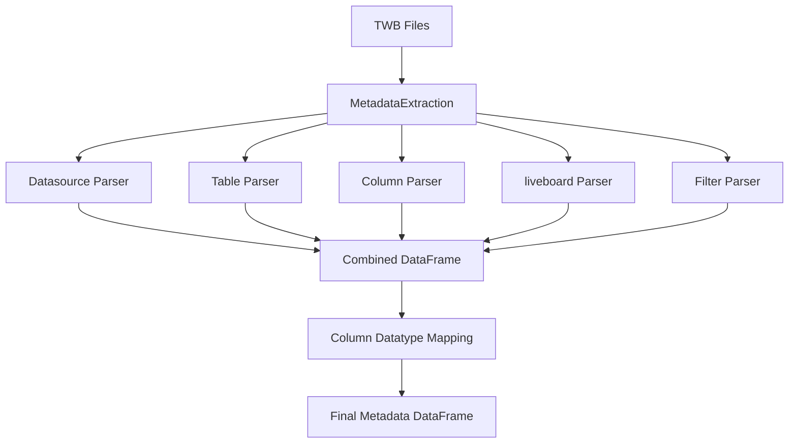
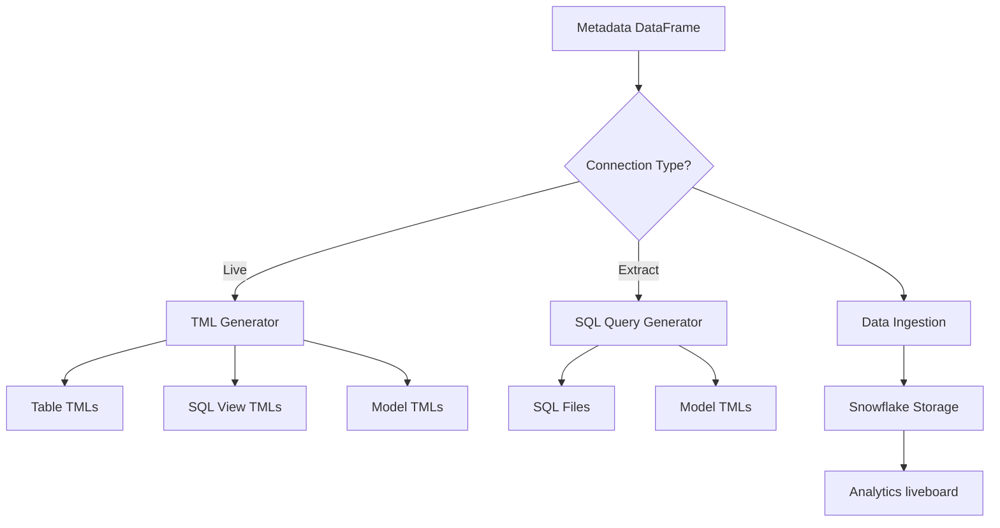

# Developer Guide - Tableau to ThoughtSpot Migration Tool

This guide provides a comprehensive overview of the codebase structure and architecture for developers working on the Tableau to ThoughtSpot migration tool.

## Table of Contents

- [Project Architecture](#project-architecture)
- [Codebase Structure](#codebase-structure)
- [Key Modules](#key-modules)
- [Data Flow](#data-flow)
- [Core Classes](#core-classes)
- [Formula Conversion System](#formula-conversion-system)
- [Configuration System](#configuration-system)
- [Database Integration](#database-integration)
- [Development Workflow](#development-workflow)
- [Testing](#testing)
- [Adding New Features](#adding-new-features)

## Project Architecture

The tool follows a modular architecture with clear separation of concerns:

```
┌─────────────────────┐    ┌─────────────────────┐    ┌─────────────────────┐
│   Input Layer       │    │  Processing Layer   │    │   Output Layer      │
│                     │    │                     │    │                     │
│ • TWB File Reading  │───▶│ • Metadata Parsing  │───▶│ • TML Generation    │
│ • XML Parsing       │    │ • Formula Conversion│    │ • SQL Generation    │
│ • Validation        │    │ • Data Mapping      │    │ • Report Generation │
└─────────────────────┘    └─────────────────────┘    └─────────────────────┘
                                      │
                                      ▼
                           ┌─────────────────────┐
                           │   Storage Layer     │
                           │                     │
                           │ • Snowflake ETL     │
                           │ • Metadata Storage  │
                           │ • Analytics DB      │
                           └─────────────────────┘
```

## Codebase Structure

```
ts_migration/
├── main.py                          # Entry point and CLI interface
├── requirements.txt                 # Python dependencies
│
├── configs/                         # Configuration and templates
│   ├── configs.py                  # Configuration management
│   └── tml_class_files/            # TML templates for different objects
│       ├── TEMPLATE.table.tml
│       ├── TEMPLATE.liveboard.tml
│       └── ...
│
├── mapping_files/                   # CSV mapping files
│   ├── datatype.csv                # Data type mappings
│   ├── datasource.csv              # Data source mappings
│   ├── joins.csv                   # Join type mappings
│   └── ...
│
├── twb_parser/                      # TWB file parsing (note: typo in folder name)
│   ├── metadata_parser.py          # Main orchestrator for parsing
│   ├── datasource.py               # Data source extraction
│   ├── table.py                    # Table metadata extraction
│   ├── column.py                   # Column and calculated field parsing
│   ├── liveboard.py                # liveboard metadata
│   ├── filters.py                  # Filter extraction
│   └── ...
│
├── tableau_ts_migrator/             # Core migration logic
│   ├── migrator.py                 # Main migration orchestrator
│   ├── tml_generator.py            # TML file generation
│   ├── sql_query_generator.py      # SQL query generation
│   ├── generate_model_tml.py       # Model TML creation
│   ├── filter_migrator.py          # Filter migration logic
│   └── tml_templates/              # TML templates
│       ├── TEMPLATE.table.tml
│       ├── TEMPLATE.model.tml
│       └── TEMPLATE.sqlview.tml
│
├── utilities/                       # Shared utilities
│   ├── data_ingest.py              # Snowflake data ingestion
│   ├── file_reader.py              # File I/O operations
│   ├── file_writer.py              # File writing utilities
│   ├── logger_config.py            # Logging configuration
│   ├── constants.py                # Application constants
│   └── formula_conversion/         # Formula conversion system
│       ├── formula.py              # Main conversion interface
│       └── src/                    # ANTLR generated code
│           ├── grammar/            # ANTLR grammar files
│           └── TSVisitor.py        # Formula visitor implementation
│
├── tests/                          # Test suite
│   ├── conftest.py                # Pytest configuration
│   └── test_formula_converter.py  # Formula conversion tests
│
└── Tableau Evaluation Report TML/  # Pre-built analytics liveboard
    ├── Manifest.yaml
    ├── *.table.tml                # Analytics tables
    ├── *.model.tml                # Analytics model
    └── .liveboard.tml
```

## Key Modules

### 1. Entry Point (`main.py`)

**Purpose**: CLI interface and main execution flow
**Key Functions**:
- `run_job()`: Main execution logic
- Argument parsing and validation
- Operation routing (feasibility vs convert)

```python
# Main execution flow
def run_job(input_folder, output_folder, live_flag, operation, configs=None):
    # 1. Setup logging
    # 2. Parse TWB files (MetadataExtraction)
    # 3. Route to feasibility or convert operation
    # 4. Upload to Snowflake and generate reports
```

### 2. Metadata Parser (`twb_parser/metadata_parser.py`)

**Purpose**: Orchestrates the parsing of TWB files
**Key Class**: `MetadataExtraction`
**Workflow**:
1. Initialize parser instances for each component
2. Parse all TWB files in input directory
3. Extract metadata using specialized parsers
4. Combine results and generate execution metadata

### 3. Migration Engine (`tableau_ts_migrator/migrator.py`)

**Purpose**: Main migration logic and file generation
**Key Class**: `Migrator`
**Workflow**:
1. Process each TWB file and datasource
2. Validate Snowflake compatibility
3. Route based on connection type (Live vs Extract)
4. Generate appropriate output files

## Data Flow

### 1. Parsing Phase



### 2. Migration Phase



## Core Classes

### 1. MetadataExtraction (`twb_parser/metadata_parser.py`)

**Purpose**: Main orchestrator for TWB parsing
**Key Methods**:
- `start_exe(flag)`: Main execution method
- `dataextract()`: Extract metadata from single TWB file

**Responsibilities**:
- Initialize component parsers
- Process all TWB files
- Generate execution metadata
- Co-ordinate data mapping operations

### 2. Migrator (`tableau_ts_migrator/migrator.py`)

**Purpose**: Main migration orchestrator
**Key Methods**:
- `migrate(parsed_dump, output_folder)`: Main migration entry point
- `convert_datasources()`: Process each datasource
- `create_model_tml()`: Generate model TML files

**Responsibilities**:
- Validate database compatibility (Snowflake only)
- Route processing based on connection type
- Coordinate TML/SQL generation
- Update metadata with output file information

### 3. TML_Generator (`tableau_ts_migrator/tml_generator.py`)

**Purpose**: Generate ThoughtSpot TML files for live connections
**Key Methods**:
- `generate_tml()`: Main generation method
- `create_table_tml()`: Generate table TML files
- `create_sql_view_tml()`: Generate SQL view TML files

**Dependencies**:
- Uses `thoughtspot_tml` library for TML manipulation
- Requires TML templates from `tml_templates/`

### 4. Sql_Query_Generator (`tableau_ts_migrator/sql_query_generator.py`)

**Purpose**: Generate SQL queries for extract connections
**Key Methods**:
- `generate_sql_query()`: Main SQL generation
- `generate_table_join_query()`: Create join queries
- `column_info()`: Extract column information

## Formula Conversion System

The tool includes a sophisticated formula conversion system using ANTLR (ANother Tool for Language Recognition).

### Architecture

```
Tableau Formula --> ANTLR Lexer --> ANTLR Parser --> Parse Tree --> TSVisitor --> ThoughtSpot Formula
```

### Key Components

1. **Grammar Definition** (`utilities/formula_conversion/src/grammar/TblCalcField.g4`)
   - ANTLR grammar for Tableau calculated fields
   - Defines syntax rules for parsing Tableau formulas

2. **Generated Parser** (Auto-generated from grammar)
   - `TblCalcFieldLexer.py`: Tokenizes input formulas
   - `TblCalcFieldParser.py`: Parses tokens into syntax tree

3. **Visitor Implementation** (`utilities/formula_conversion/src/TSVisitor.py`)
   - Traverses parse tree and converts to ThoughtSpot syntax
   - Contains mapping dictionary for function translations

### Formula Mapping Examples

```python
formula_mapping = {
    "CEILING": "ceil",
    "DIV": "safe_divide",
    "LOG": "log10",
    "POWER": "pow",
    "SQUARE": "sq",
    "LEN": "strlen",
    "MID": "substr",
    # ... more mappings
}
```

### Adding New Formula Support

1. Update grammar file if new syntax needed
2. Add function mapping in `TSVisitor.py`
3. Implement visitor method for new constructs
4. Add test cases
5. Regenerate ANTLR files if grammar changed

## Configuration System

### Mapping Files (`mapping_files/`)

The tool uses CSV files for various mappings:

- **`datatype.csv`**: Maps Tableau data types to ThoughtSpot/Mode equivalents
- **`datasource.csv`**: Maps database connection types
- **`joins.csv`**: Maps Tableau join types to ThoughtSpot joins
- **`chart_prop.csv`**: Chart property mappings
- **`object_feature_filter.csv`**: Filter mappings

### TML Templates

Located in `tableau_ts_migrator/tml_templates/`:
- `TEMPLATE.table.tml`: Template for table TML files
- `TEMPLATE.model.tml`: Template for model TML files
- `TEMPLATE.sqlview.tml`: Template for SQL view TML files

### Environment Configuration

Environment variables are loaded from `twb_parser/.env`:
```env
SNOWFLAKE_USER=username
SNOWFLAKE_PASSWORD=password
SNOWFLAKE_ACCOUNT=account
# ... other Snowflake credentials
```

## Database Integration

### Snowflake Integration (`utilities/data_ingest.py`)

**Class**: `DataIngress`
**Purpose**: Handle all Snowflake operations

**Key Methods**:
- `write_dump_data(df)`: Upload metadata to CDW (Snowflake in this case)
- `call_procedures(exec_id)`: Execute stored procedures
- `create_session()`: Create CDW session (Snowflake in this case)

**Stored Procedures**:
1. `MIGRATION_EXECUTION_HEADER`: Process execution metadata
2. `twb_file`: Process TWB file information
3. `Header_table`: Process header tables
4. `Detail_table`: Process detail tables
5. `View_Model`: Create views and models

### Database Schema

**Database**: `TB_2_TS`
**Schema**: `TTTM_RAW`
**Main Table**: `RAW_DATA_DUMP` (initial data load)

## Development Workflow

### Setting Up Development Environment

1. **Clone and Setup**:
   ```bash
   git clone <repository-url>
   cd ts_migration
   python -m venv venv
   source venv/bin/activate  # Windows: venv\Scripts\activate
   pip install -r requirements.txt
   ```

2. **Configure Environment**:
   ```bash
   # Create twb_parser/.env with Snowflake credentials
   cp twb_parser/.env.example twb_parser/.env
   # Edit with your credentials
   ```

3. **Run Tests**:
   ```bash
   python -m pytest tests/ -v
   ```

### Code Style Guidelines

- Follow PEP 8 conventions
- Use type hints where possible
- Add docstrings for public methods
- Use meaningful variable names
- Keep functions focused and small

### Logging

The tool uses Python's logging module configured in `utilities/logger_config.py`:

```python
from utilities.logger_config import get_logger

logger = get_logger()
logger.info("Processing started")
logger.error("Error occurred: %s", error_message)
```

## Testing

### Test Structure

- **Location**: `tests/` directory
- **Framework**: pytest
- **Configuration**: `conftest.py`

### Running Tests

```bash
# Run all tests
python -m pytest tests/

# Run specific test file
python -m pytest tests/test_formula_converter.py

# Run with coverage
python -m pytest tests/ --cov=utilities --cov=tableau_ts_migrator
```

### Test Categories

1. **Unit Tests**: Test individual functions and methods
2. **Integration Tests**: Test component interactions
3. **Formula Tests**: Test formula conversion accuracy

## Adding New Features

### 1. Adding New Data Source Support

Currently only Snowflake is supported. To add new data sources:

1. **Update Validation** (`tableau_ts_migrator/migrator.py`):
   ```python
   # Remove or modify this check:
   if cdw_type != 'snowflake':
       raise ValueError(f"Migration not supported for {cdw_type}")
   ```

2. **Add Mapping Files**:
   - Update `mapping_files/datasource.csv`
   - Add connection-specific mappings

3. **Update Data Ingestion** (`utilities/data_ingest.py`):
   - Add new database connector
   - Modify `DataIngress` class

### 2. Adding New Formula Functions

1. **Update Grammar** (if needed):
   ```antlr
   // In TblCalcField.g4
   function_name
       : 'SUM' | 'AVG' | ... | 'NEW_FUNCTION'
   ```

2. **Add Mapping** (`utilities/formula_conversion/src/TSVisitor.py`):
   ```python
   formula_mapping = {
       # ... existing mappings
       "NEW_TABLEAU_FUNC": "new_ts_func",
   }
   ```

3. **Implement Visitor Method** (if complex logic needed):
   ```python
   def visitNewFunction(self, ctx):
       # Custom conversion logic
       return converted_formula
   ```

### 3. Adding New TML Object Types

1. **Create Template**:
   - Add new template in `tableau_ts_migrator/tml_templates/`

2. **Update Generator**:
   - Modify `TML_Generator` class
   - Add new generation method

3. **Update Migrator**:
   - Call new generator method
   - Handle new object type routing

### 4. Debugging Tips

1. **Enable Debug Logging**:
   ```python
   import logging
   logging.getLogger().setLevel(logging.DEBUG)
   ```

2. **Inspect DataFrames**:
   ```python
   # Add debug prints in processing methods
   print(f"DataFrame shape: {df.shape}")
   print(f"Columns: {df.columns.tolist()}")
   df.to_csv("debug_output.csv", index=False)  # Temporary debugging
   ```

3. **Test Formula Conversion**:
   ```python
   from utilities.formula_conversion import formula
   result = formula.convert("CEILING([Sales])")
   print(f"Converted: {result}")
   ```

## Performance Considerations

### Memory Management

- DataFrames are processed in chunks for large files
- Snowflake uploads are batched (600 records per batch)
- Use generators for large data processing where possible

### Optimization Opportunities

1. **Parallel Processing**: TWB files could be processed in parallel
2. **Caching**: Formula conversion results could be cached
3. **Streaming**: Large TWB files could be streamed instead of loaded entirely

## Troubleshooting Common Issues

### 1. ANTLR Grammar Issues

**Problem**: Formula conversion fails
**Solution**: 
- Check grammar file syntax
- Regenerate parser files
- Verify visitor implementation

### 2. CDW Connection Issues

**Problem**: Database connection fails
**Solution**:
- Verify credentials in `.env` file
- Check network connectivity
- Validate CDW account settings

### 3. TML Generation Issues

**Problem**: Invalid TML files generated
**Solution**:
- Verify template files
- Check data mapping accuracy
- Validate ThoughtSpot TML library usage

---

This developer guide should help new team members understand the codebase structure and contribute effectively to the project. For specific questions, refer to the inline code documentation and existing test cases. 
