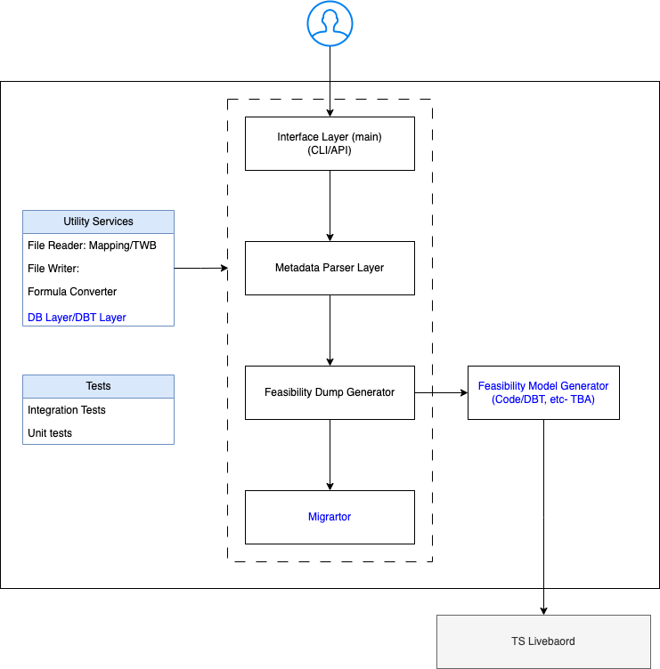

# Tableau to ThoughtSpot Migration Tool

[](https://travis-ci.org/joemccann/dillinger)

A comprehensive migration tool that analyzes Tableau workbooks (.twb files) and generates ThoughtSpot TML (ThoughtSpot Modeling Language) files to facilitate seamless migration from Tableau to ThoughtSpot.

## Table of Contents

- [Overview](#overview)
- [Features](#features)
- [Architecture](#architecture)
- [Installation](#installation)
- [Quick Start](#quick-start)
- [Usage](#usage)
- [Migration Behavior](#migration-behavior)
- [Formula Conversion](#formula-conversion)
- [Database Setup](#database-setup)
- [Migration Analysis liveboard](#migration-analysis-liveboard)
- [Supported Features](#supported-features)
- [Contributing](#contributing)
- [License](#license)

## Overview

This tool provides automated migration capabilities from Tableau to ThoughtSpot by:

- **Analyzing** Tableau workbooks (.twb) for migration feasibility
- **Generating** ThoughtSpot TML files for live connections
- **Creating** SQL files for extract-based data sources
- **Converting** Tableau calculated fields to ThoughtSpot formulas
- **Supporting** comprehensive migration reports and analytics

The tool includes an ETL pipeline that processes Tableau metadata and, while Snowflake is used in this demo, it supports integration with almost all major cloud data warehouses (CDWs) for comprehensive migration analysis.

## Features

### ✅ Supported Features

- **Data Connections**: Live and Extract connections
- **Data Sources**: Tables with join relationships
- **Calculated Fields**: Formula conversion using ANTLR grammar
- **Logic**: Formulas and filters
- **Output**: 
  - **Live connections**: TML files (tables, models, SQL views)
  - **Extract connections**: SQL files + Model TMLs

### ❌ Currently Unsupported

- Parameters
- Groups
- Bins
- Sets

## Architecture



The migration tool follows a three-tier architecture:

1. **Input Layer**: Tableau workbook (.twb) file processing
2. **Processing Layer**: Metadata extraction, formula conversion, and transformation
3. **Output Layer**: TML/SQL file generation and migration reporting liveboard

## Installation

### Prerequisites

- Python 3.10.x to 3.12.x (recommended: 3.11.5)
- CDW account for migration analytics and data sources. (Snowflake in this case)
- ThoughtSpot cluster access

### Setup

1. **Clone the repository**
   ```bash
   git clone https://github.com/YOUR_USERNAME/ts_migration.git
   cd ts_migration
   ```

2. **Create virtual environment**
   ```bash
   python -m venv venv
   source venv/bin/activate  # On Windows: venv\Scripts\activate
   ```

3. **Install dependencies**
   ```bash
   pip install -r requirements.txt
   ```

4. **Configure environment variables**
   Create a `.env` file in the `twb_parser` directory with your Snowflake credentials:
   ```env
   SNOWFLAKE_USER=your_username
   SNOWFLAKE_PASSWORD=your_password
   SNOWFLAKE_ACCOUNT=your_account
   SNOWFLAKE_WAREHOUSE=your_warehouse
   SNOWFLAKE_DATABASE=your_database
   SNOWFLAKE_SCHEMA=your_schema
   SNOWFLAKE_ROLE=your_role
   ```

## Quick Start

```bash
# Basic migration (default: convert operation)
python main.py ./input_folder ./output_folder

# Explicit convert operation
python main.py convert ./input_folder ./output_folder

# Migration with live connection preference for extracts
python main.py convert ./input_folder ./output_folder --live_flag


## Usage

### Command Line Interface

```bash
python main.py [operation] input_folder output_folder [--live_flag]
```

**Arguments:**
- `operation` (optional): `feasibility` or `convert` (default: `convert`)
- `input_folder`: Directory containing Tableau (.twb) files
- `output_folder`: Directory for generated output files
- `--live_flag`: Force live connections for extract-based Tableau workbooks

### Operations

**Feasibility Analysis:**
- Parses Tableau workbooks and analyzes migration compatibility
- Uploads metadata to Snowflake for analysis
- Provides migration feasibility report via liveboard link

**Convert:**
- Performs full migration with TML/SQL file generation
- Uploads metadata to Snowflake for analysis
- Provides migration feasibility report via liveboard link
- Generates output files based on connection type

**IMPORTANT** - Once the output files (.tml) are generated, they can be manually imported into the ThoughtSpot cluster after setting up the connection between the CDW and ThoughtSpot.

## Migration Behavior

### Live Connections

For Tableau workbooks with live connections:

**Output Structure:**
```
output_folder/
├── Live/
│   ├── Table TML/
│   │   └── *.table.tml
│   ├── SQL View TML/
│   │   └── *.sqlview.tml
│   └── Model TML/
│       └── *.model.tml
└── combined_output.csv
```

**Generated Files:**
- **Table TMLs**: Data source definitions for tables
- **SQL View TMLs**: Custom SQL query definitions
- **Model TMLs**: Data model configurations with joins and formulas

### Extract Connections

For Tableau workbooks with extract connections:

**Output Structure:**
```
output_folder/
├── Extract/
│   ├── SQL Files/
│   │   └── *.sql
│   └── Model TML/
│       └── *.model.tml
└── combined_output.csv
```

**Generated Files:**
- **SQL Files**: Query files for use with Mode or similar tools (***These files (.sql) can be imported in Analyst Studio and can be published as a dataset in Thoughtspot cluster***)
- **Model TMLs**: Data model configurations for the extracted data

### Connection Override

Use `--live_flag` to force extract connections to be treated as live connections, generating TML files instead of SQL files.

## Formula Conversion

The tool includes sophisticated formula conversion capabilities:

### Supported Functions

The tool uses ANTLR grammar to parse and convert Tableau calculated fields:

- **Aggregate Functions**: SUM, AVG, MIN, MAX, COUNT, COUNTD
- **Mathematical Functions**: ABS, CEILING, FLOOR, ROUND, POWER, SQRT
- **String Functions**: LEN, MID, LEFT, REPLACE
- **Date Functions**: DATE, DAY, MONTH, YEAR, TODAY, NOW
- **Logical Functions**: IF, CASE, WHEN, THEN, ELSE
- **Statistical Functions**: MEDIAN, STDEV, VAR

### Conversion Examples

| Tableau Formula | ThoughtSpot Formula |
|-----------------|-------------------|
| `CEILING([Sales])` | `ceil([Sales])` |
| `LEN([Product])` | `strlen([Product])` |
| `POWER([Sales], 2)` | `pow([Sales], 2)` |

### Unsupported Formulas

Formulas marked as "TBD" (To Be Determined) require manual conversion after migration.

## Database Setup

### Snowflake Requirement

**Important**: This tool **supports all major cloud data warehouses** (Snowflake in this case) Using other CDWs requires making appropriate changes to the code.
### Snowflake Configuration

The tool uses Snowflake for both:
1. **Data Sources**: Source tables for migration
2. **Analytics**: Migration metadata storage

#### Database Structure

**Database**: `TB_2_TS`
**Schema**: `TTTM_RAW`

#### Tables (15)
- `MIGRATION_EXECUTION_HEADER`
- `MIGRATION_EXECUTION_DETAIL`
- `TWB_FILE`
- `DATASOURCE_HEADER`
- `DATASOURCE_DETAIL`
- `WORKSHEET_HEADER`
- `WORKSHEET_DETAIL`
- `WORKSHEET_DATASOURCE_XREF`
- `liveboard_HEADER`
- `liveboard_DETAIL`
- `TABLE_HEADER`
- `TABLE_DETAIL`
- `TABLE_OUTPUT_FILE`
- `DATASOURCE_TABLE_XREF`
- `DATASOURCE_COLUMN_XREF`

#### Views (3)
- `STG_WORKSHEET_NOT_IN_liveboard`
- `STG_DATASOURCE_NOT_IN_WORKSHEET`
- `STG_TABLES_CONNECTED_WITH_UNSUPPORTED_DATA_PLATFORM`

#### ETL Process

1. **Data Extraction**: Tableau workbooks are parsed and metadata extracted
2. **Raw Data Load**: Metadata ingested into `RAW_DATA_DUMP` table
3. **Data Transformation**: Five SQL stored procedures transform and load data:
   - `MIGRATION_EXECUTION_HEADER`
   - `twb_file`
   - `Header_table`
   - `Detail_table`
   - `View_Model`
4. **Analytics Ready**: Data available for migration analysis liveboard

**Data Model**: [View ERD](https://dbdiagram.io/d/Tab2TS_report_model-66a0f6fa8b4bb5230e3a2c1f)

## Migration Analysis Liveboard

### Setup Instructions

1. **Configure Connection**: Set up connection between Snowflake and ThoughtSpot
2. **Import TML Files**: Import all files from the `Tableau Evaluation Report TML` folder to your ThoughtSpot cluster
3. **Access liveboard**: The tool provides a direct link to the staging liveboard after execution

### liveboard URL

The tool uses a predefined staging environment:
```
https://embed-1-do-not-delete.thoughtspotstaging.cloud/?param1=Execution_ID&paramVal1={execution_id}&#/pinboard/c215130d-a735-421f-bda6-dac81abd7044
```
**RUNTIME PARAMETER in OBJECT URL**: [DOCUMENTATION](https://developers.thoughtspot.com/docs/runtime-params)


### liveboard Features

- Migration feasibility analysis
- Unsupported feature identification
- Data source complexity assessment
- Conversion success metrics
- Formula conversion status
- Join compatibility analysis

## Supported Features

| Feature Category | Live Connections | Extract Connections | Details |
|------------------|------------------|-------------------|---------|
| **Data Sources** | ✅ TML files | ✅ SQL files | Tables with join relationships |
| **Custom SQL** | ✅ SQL View TML | ✅ Included in SQL | Custom query support |
| **Calculated Fields** | ✅ Model formulas | ✅ Model formulas | ANTLR-based conversion |
| **Joins** | ✅ Model joins | ✅ SQL joins | Complete relationship support |
| **Filters** | ✅ Model/Live filters | ✅ SQL WHERE clauses | Basic filtering capabilities |
| **Data Platform** | ✅ All major CDWs | ✅ All major CDWs | -- |
| **Advanced Features** | ❌ Parameters, Groups, Bins, Sets | ❌ Parameters, Groups, Bins, Sets | Planned for future releases |

## TML File Configuration

Generated TML files include:
- **Hardcoded connection name**: `dgprojectTS` (requires manual update)
- **Index type**: `DONT_INDEX` for all columns
- **Default aggregation**: Based on column type mapping

## Contributing

We welcome contributions from the community! Please see our [Contributing Guidelines](#contributing-guidelines) below.

### Contributing Guidelines

#### Getting Started

1. **Fork the repository** and clone your fork
2. **Create a feature branch**: `git checkout -b feature/your-feature-name`
3. **Set up development environment** following the installation instructions

#### Development Standards

- **Code Style**: Follow PEP 8 guidelines
- **Type Hints**: Use type annotations where appropriate
- **Documentation**: Add docstrings for new functions/classes
- **Testing**: Write tests for new features in the `tests/` directory

#### Submission Process

1. **Run Tests**: Ensure all tests pass with `python -m pytest tests/`
2. **Commit Changes**: Use conventional commit messages:
   - `feat:` for new features
   - `fix:` for bug fixes
   - `docs:` for documentation updates
   - `test:` for test additions
   - `refactor:` for code refactoring

3. **Submit Pull Request**: Include a clear description of changes and testing performed

#### Pull Request Template

```markdown
## Description
Brief description of changes

## Type of Change
- [ ] Bug fix
- [ ] New feature  
- [ ] Documentation update
- [ ] Test addition
- [ ] Refactoring

## Testing
Description of testing performed

## Checklist
- [ ] Code follows style guidelines
- [ ] Self-review completed
- [ ] Documentation updated
- [ ] Tests pass
- [ ] No new warnings generated
```

## Known Limitations

- **Hardcoded Values**: Connection names and URLs require manual updates
- **Formula Coverage**: Some complex formulas may need manual conversion
- **Extract Behavior**: Generates SQL files, not TMLs for direct ThoughtSpot import

## License

Please refer to the LICENSE file for details.

## Support

- **Issues**: Report bugs and request features via GitHub Issues
- **Documentation**: Refer to the code documentation and this README
- **Community**: Join our community discussions for help and best practices

---

**Supported Python Versions**: 3.10.x - 3.12.x (Recommended: 3.11.5)


